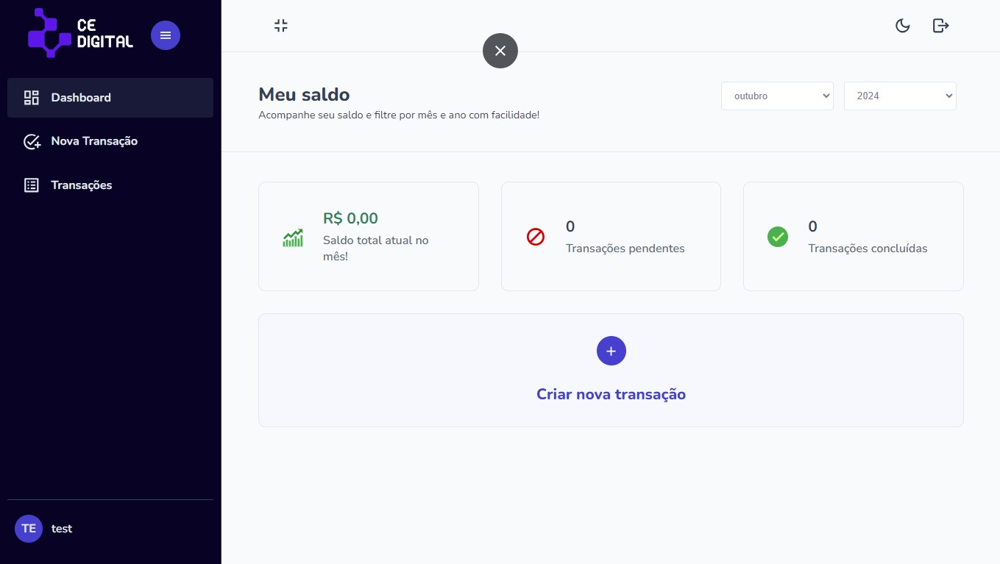

# CE Digital Finanças

**CE Digital Finanças** é um projeto de controle de finanças desenvolvido durante o curso **ReactJS 18 com TypeScript + Projetos - Do Básico ao Avançado**, da **GRF Cursos**. O sistema permite gerenciar suas transações financeiras de forma prática e eficiente.

## 🚀 Tecnologias Utilizadas

- **ReactJS**
- **TypeScript**
- **Vite**
- **React-Router**
- **Axios**
- **React-Redux**
- **Styled-Components**
- **React-Icons**
- **React-Spinners**

## 🌐 Demo

<a href="https://ce-digital-finances.netlify.app/" target="_blank">
    
</a>

O projeto está disponível para visualização no seguinte link:

[CE Digital Finanças](https://ce-digital-finances.netlify.app/)

## 📚 Funcionalidades

- Adicionar, editar e remover transações.
- Visualizar relatórios financeiros.
- Filtros por data, tipo de transação e valor.
- Interface amigável e responsiva.

## 🛠️ Instalação

1. Clone o repositório:

```bash
git clone https://github.com/eoivo/ce-digital-finances
```

2. Acesse a pasta do projeto:

```bash
cd ce-digital-finances
```

3. Instale as dependências:

```bash
npm install
```

4. Inicie o projeto:

```bash
npm run dev
```

5. Acesse no navegador:

```
http://localhost:5173
```

## 📝 Como Usar

- Navegue pelas páginas usando o **React-Router**.
- Adicione transações, visualize relatórios e filtre por diferentes critérios.
- Gerenciamento de estado global feito com **React-Redux**.
- Os estilos são aplicados usando **Styled-Components**.

## 🤝 Contribuição

1. Faça um fork do repositório.
2. Crie uma nova branch (`git checkout -b feature/nova-funcionalidade`).
3. Faça as alterações e commit (`git commit -m 'Adiciona nova funcionalidade'`).
4. Faça push para a branch criada (`git push origin feature/nova-funcionalidade`).
5. Abra um Pull Request.

## 🧑‍💻 Autor

**Ivo Fenrnades**  
[LinkedIn](https://linkedin.com/in/ivo-dev/) | [GitHub](https://github.com/eoivo)
